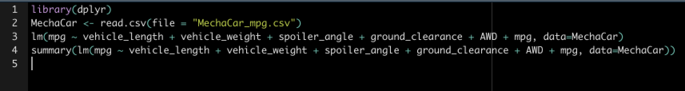
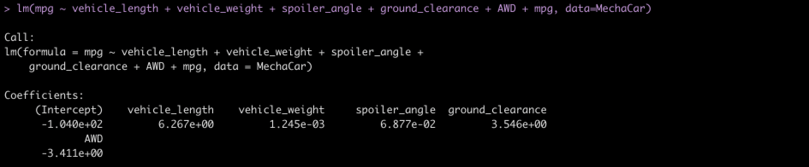
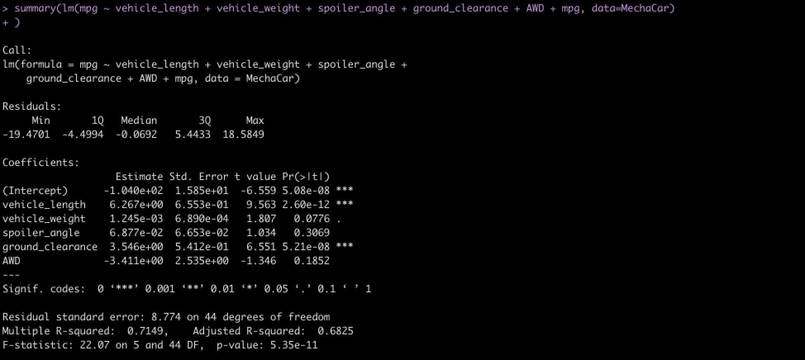
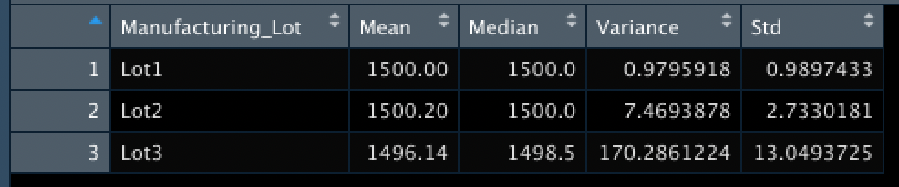
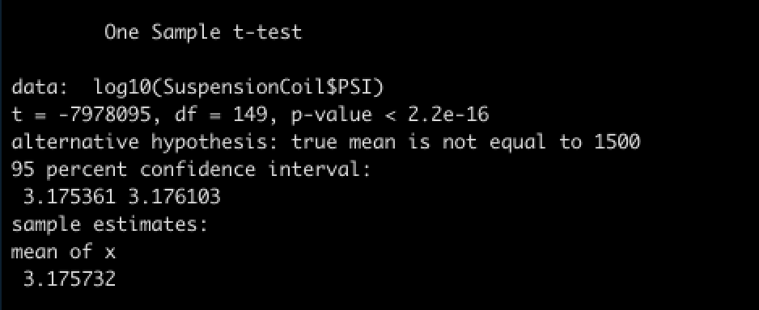
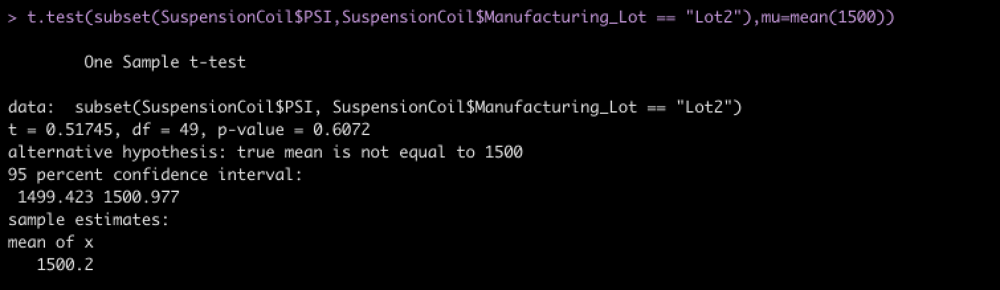

# MechaCar_Statistical_Analysis

## Linear Regression to Predict MPG

We used the following code in R to perform a multiple regression to see which values most impacted fuel efficiency: 

We got the following results for the multiple regression: 

And the following information was returned when we got the summary statistics for the multiple regression: 

Our R-squared value was 0.7149. This means that about 71% of mpg predictions will be correct when using this linear model. Out p-value of 5.35e-11 is much smaller that the assumed significance level of 0.05%. Therefore, there is sufficient evidence to reject our null hypothesis which means that the slope of our linear model is not zero. 

A small Pr(>|t|) value represents the probability that each coefficient contributes to a random amount of variance to the linear model. Here, these amounts show that vehicle length and ground clearance have a significant impact on mpg. 

## Summary Statistics on Suspension Coils

The following screenshots show data frames relating to the PSI in suspension coils. The first shows summary statistics on the coils at all Manufacturing lots: 

The following image shows the statistics of the coils broken into the categories for the three separate manufacturing lot: 

The design specifications for the MechaCar suspension coils dictate that the variance of the suspension coils must not exceed 100 poinds per square inch. Here, we can see that the coils from Lots 1 and 2 fall within this specificaiton. The coils from Lot 3 however, show a variance of over 170 psi. This is unacceptable accourding to our standard. This data should be examined further to understand why the variance is so much higher at Lot 3. 

## T-Tests on Suspension Coils

The following image shows the results of a T-Test run on all coils compared to the average psi of 1500: 

The following three images show the T-Test results of each of the three lots compared against the average psi of 1500: 

In Lots 1 and 2, the p-value is significantly higher than our chosen significance level of 0.05, so we can conclude there is no statistical difference between the observed sample mean and the presumed population mean of 1500. In Lot 3, the p-value is just under the significance level, which means there is a statistical difference between the sample mean for Lot 3 and the presumed population mean of 1500. 

## Study Design: MechaCar vs Competition

An additional study that could be performed would be to compare the safety rating of the MechaCar to other cars in the same class. The null hypotheses would be that there is no difference in the safety rating of MechaCar and the mean safety writing of all other cars in the class. The alternative hypotheses would be that there is in fact a difference in the two. We could run a T-Test on the two sets of vehicles and see what the p-value comes out to be. In order to perform this, we would need the safety rating of the MechaCar and the safety ratings of all other vehicles in the class. 
